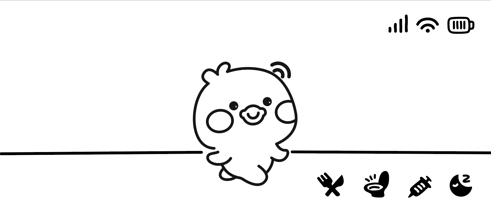

# Tuya T5 Pocket AI

The T5 Pocket is a portable device designed for AI speech and vision large language model (LLM) applications.

## Product Highlights
- Tuya T5 Wi-Fi & Bluetooth module
- 2.9" monochrome low-power LCD screen
- 4G CAT.1 support
- BMI270 6-axis IMU sensor
- Built-in 1-channel speaker and 2-channel microphones
- Audio MUX for multi-path switching (hardware speaker loopback)
- Power management IC (PMIC)
- Joystick (X-Y + button)
- 4 user buttons
- On-board 2-channel serial download and debug interface
- Expansion port
- DVP camera
- Expansion pogo pin (power + UART)
- Expansion 10-pin header (I2C/SPI/UART/GPIO)
- USB Type-C 2.0 port (charging, flashing, debugging)

## User Input Definitions

| Input         | Description                                      |
|---------------|--------------------------------------------------|
| Joystick      | Menu/app navigation                              |
| Joystick Press| Not defined                                      |
| A Button      | Confirm/Select/Game A                            |
| B Button      | Cancel/Back/Game B                               |
| Function Key  | Quick access for AI-LLM, audio, and other features|
| Menu Key      | Main menu access                                 |
| User LED      | Indicates AI activity, user-definable            |
| Reset Button  | Hardware reset for T5 MCU                        |

## Tuya AI Pet

Experience the next generation of virtual pets! The Tuya AI Pet Console demo showcases advanced audio, vision, and LLM features, allowing your digital companion to interact with you through natural voice conversations and emotion sensing. Enjoy a Tamagotchi-style adventure—your pet responds to your mood and voice, providing an immersive and fun virtual companion experience.

### Key Software Design Points (TODOs):

- LVGL UI development: Key/joystick event-driven menu navigation. UI can be converted to header data files. Battery/WiFi/4G status displayed in the top right corner.
- Secondary menu interface: Text list for food selection and interactive button list.
- Multimodal AI (text + voice): Report text as pet state parameters, return emotion for rendering.
- Pet states (e.g., hunger, happiness, cleanliness, health) managed by a state machine, supporting time/event-driven changes and persistent storage (e.g., flash). On boot, automatically restore and update state based on elapsed time.
- Synchronize time via Wi-Fi/4G to ensure accurate state updates.
- User actions (feeding, cleaning, playing, etc.) and system events (e.g., low battery) trigger state changes. Provide API for LLM to query/update state for AI context awareness.
- Synthesized sound engine (e.g., emotion, key, reward, sick, eat, etc.). UI/UX uses icons, animations, and progress bars to display state.
- Pet notifies user when attention is needed via sound/LED/notification (e.g., 3-hour timer).
- Design allows for easy extension of new states/behaviors (e.g., sleep, exercise, mood swings). Ensure atomic and thread-safe state changes under RTOS/multithreading.
- Complete state parameter documentation.
