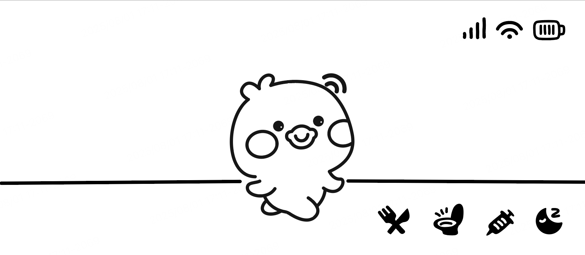

# 涂鸦 T5 AI 口袋机

T5 Pocket 是一款专为 AI 语音与视觉大模型（LLM）能力设计的便携式主机。

## 产品亮点
- 涂鸦 T5 Wi-Fi & 蓝牙模块
- 2.9 英寸单色低功耗 LCD 屏幕
- 支持 4G CAT.1
- BMI270 六轴传感器
- 内置 1 路扬声器和 2 路麦克风
- 音频多路MUX复用切换 (扬声器硬件回路切换)
- 电源管理芯片（PMIC）
- 摇杆（X-Y+按键）
- 4 个用户按键
- 板载 2 路串口下载和调试接口
- 扩展接口
- DVP 摄像头
- 扩展Pogo Pin弹簧针（电源+UART）
- 扩展 10 针排针（I2C/SPI/UART/GPIO）
- USB Type-C 2.0 接口（充电+烧录+调试）

## 用户输入定义
实际硬件输入HID

| 输入         | 功能描述                                 |
|--------------|------------------------------------------|
| 摇杆         | 菜单/应用导航                            |
| 摇杆按下     | 功能未定义                               |
| A 键         | 确认/选择/游戏 A                         |
| B 键         | 取消/返回/游戏 B                         |
| 功能键       | AI-LLM、音频及其他应用功能快捷入口        |
| 菜单键       | 主菜单访问                               |
| 用户 LED     | 指示 AI 功能活动，可自定义                |
| 复位键       | T5 MCU 硬件复位                          |

## 涂鸦 AI 宠物

体验新一代虚拟宠物！涂鸦 AI 宠物主机演示展示了先进的音频，视觉大，文本游戏模型（LLM）功能，让你的数字伙伴通过自然语音对话和情感感知与您互动。享受“类拓麻歌子-电子宠物”式的冒险，你的宠物会根据你的情绪和语音做出回应，带来真正沉浸和有趣的虚拟陪伴体验。

- 摇杆手柄交互
- 语音模态交互
- 加速度传感交互
- 视觉模态感知
- 文本模态输入

### 开发中设计要点(软件TODOs):
- LVGL UI开发，按键/摇杆事件驱动菜单导航，UI设计可转为头文件数据，右上角显示电池/WiFi/4G状态。
- 二级菜单界面可以 文本List 选食物和可交互按键清单
- 多模态 AI （文本+语音，返回感情+语音）上报文本为 宠物状态参数，返回为渲染情绪
- 宠物状态（如饥饿、快乐、清洁、健康等）采用状态机管理，支持时间/事件驱动变化，并持久化存储（如flash），启动时自动恢复并根据时间差更新。
- 支持通过Wi-Fi/4G同步时间，确保状态更新准确。
- 用户操作（喂食、清洁、玩耍等）和系统事件（如低电量）触发状态变更，支持API供LLM查询/更新，实现AI上下文感知。
- 合成音效引擎（如情绪/按键/奖励/生病/进食等），UI/UX以图标、动画、进度条等直观展示状态。
- 宠物需关注时通过声音/LED/通知提醒用户。（3小时 Timer）
- 设计可扩展新状态/行为（如睡觉、锻炼、情绪波动），多线程/RTOS下保证状态变更原子性与线程安全。
- 完善状态参数。